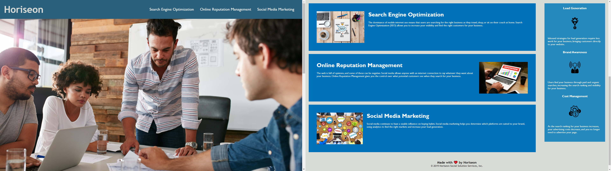

# HoriseonCompanyWebsite
Straightforward refactor to revamp company site to become more accessible with HTML & CSS and to optimize for search engines. 

## Introduction
This fun project was intended to upgrade the Horiseon site's accessibility. Areas of focus were repairing broken links, adding alt attributes, and restructing to follow semantic order. 

### Technologies 

Basic knowledge of HTML & CSS

#### Link to Website
[Horiseon Website](https://ashleywhaley.github.io/HoriseonCompanyWebsite/)

# Demo

